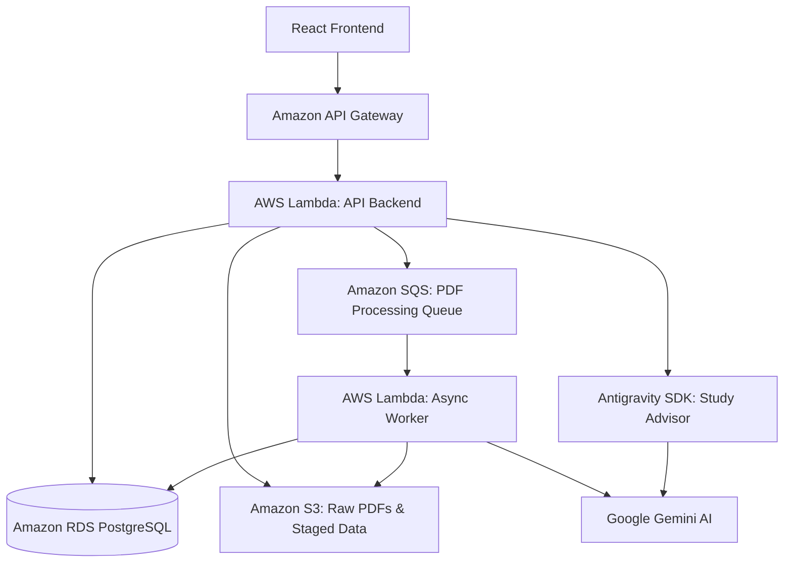

# ExamArena

ExamArena is a scalable, AI-powered exam preparation platform built for the AWS Builder Hackathon. It allows educators to ingest past paper PDFs, which are processed asynchronously via AWS Lambda and SQS, and tagged by Google's Gemini AI. Students can then take mock exams, view their analytics, and chat with a specialized AI Study Advisor.

## Features

* **Authentication:** Secure JWT-based authentication using FastAPI, backed by RDS PostgreSQL.
* **Asynchronous PDF Processing:** 
  * Educators upload PDFs which are stored in Amazon S3.
  * An Amazon SQS queue triggers a dedicated AWS Lambda worker function.
  * Questions are cropped and analyzed by Gemini AI to auto-tag subjects, topics, and difficulty.
* **Mock Exams & Analytics:** Students take exams, and their performance is stored in Amazon RDS and visualized on their dashboard.
* **AI Study Advisor:** An intelligent agent built with the Google Antigravity SDK. It analyzes user weaknesses, generates study plans, and provides targeted guidance.
* **Monitoring:** Comprehensive CloudWatch Dashboards and Alarms ensure the API remains highly available.

## Architecture



## Tech Stack

* **Frontend:** React, Vite, Tailwind CSS, Recharts, Three.js (for 3D landing page)
* **Backend:** Python, FastAPI, Mangum, SQLAlchemy, Google Antigravity SDK
* **Database:** Amazon RDS (PostgreSQL)
* **Infrastructure:** AWS SAM (Lambda, API Gateway, S3, SQS, CloudWatch)

## Running Locally

### Backend
1. `cd backend`
2. Create `.env` with `DATABASE_URL` and `GEMINI_API_KEY`.
3. `uvicorn app.main:app --reload`

### Frontend
1. `cd frontend`
2. `npm install`
3. `npm run dev`

## Deployment

The backend is deployed using AWS SAM:
```bash
sam build
sam deploy --stack-name exam-arena --resolve-s3 --capabilities CAPABILITY_IAM
```
